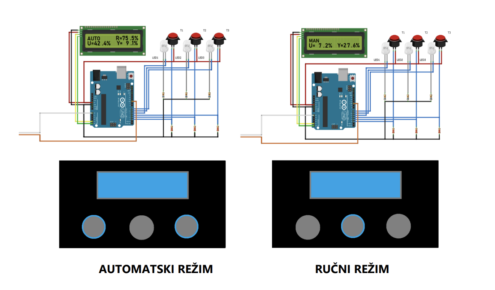

# Upravljanje u realnom vremenu (13S053URV) - Laboratorijska vežba br. 4

## Cilj vežbe
Cilj vežbe je da studenti ovladaju tehnikama programiranja mikrokontrolera u cilju
upravljanja sušarom i vazdušnom levitacijom, a kasnije stečena znanja mogu primeniti i
u upravljanju drugim industrijskim procesima.

## Zadatak vežbe
Potrebno je ispuniti sledeće zadatke:
1. Izvršiti upravljanje visinom loptice u vazdušnom kanalu
   * Potrebno je napraviti prekidnu rutinu koja će se javljati periodično u
zavisnosti od izabrane periode odabiranja, koja će se fiksno zadavati i neće
se menjati, a u okviru koje će se postavljati flag. Postavljani flag će se
tastirati u glavnom programu i u slučaju da je njegova vrednost 1, pozivaće
se rutina za izvršavanje PI regulatora
   * U glavnom programu će se između ostalih poziva nalaziti i testiranje
uslova da je flag postavljen na vrednost 1, i u slučaju pozitivnog odgovora
pozivaće se rutina za PI regulator,
   * Realizovati rutinu za PI regulator, koja će se izvršavati na poziv, kao što je
već objašnjeno, a na kraju rutine će se globalna promenjiva flag postavljati
na 0. U okviru PI regulatora potrebno je obezbediti bumpless transfer i
antiwindup dejstvo da bi se onemogućilo navijanje integratora.
2. Na LCD ekranu obezbediti prikazivanje visine, upravljanja koje se šalje sistemu,
kao i reference u AUTO režimu 
3. Omogućiti promenu režima rada i upravljanja regulatora
   * Upotrebom tastera potrebno je omogućiti promenu režima rada
(ručno/auto) upotrebom srednjeg tastera (pritiskanjem na taster se prelazi
iz automatskog režima u ručni i obrnuto). U slučaju ručnog režima
potrebno je da srednji taster sija, a u automatskom režimu potrebno je da
sijaju levi i desni taster.
   * Upotrebom levog i desnog tastera potrebno je omogućiti promenu
reference ili ručnog upravljanja. Upotrebom tastera + (desni) inkrementira
se referenca ili vrednost ručnog upravljanja za 0.5%, a upotrebom tastera -
(levi) dekrementira se referenca ili vrednost ručnog upravljanja za 0.5%, u
zavisnosti od režima rada (automatski ili ručni režim)
4. Pri promeni režima rada obezdbediti prelaz bez udara (bumpless), što se
obezbeđuje na sledeći način
   * Pri prelasku iz ručnog u automatski režim rada poslednje ručno upravljanje
upravljanje se upisuje u integralno dejstvo, a referenca postaje poslenje
merenje izlaza (𝑢𝐼 = 𝑢𝑀𝐴𝑁, 𝑅 = 𝑦)
   * Pri prelasku iz automatskog u ručni režim, upravljanje koje će postati ručno
upravljanje je zbir proporcionalnog i integralnog dejstva (𝑢𝑀𝐴𝑁 = 𝐾𝑝𝑒 + 𝑢𝐼
)
5. Potrebno je da PI regulator poseduje osobinu zaštite od navijanja integralnog
destva (antiwindup)

## Licenca
[MIT](https://github.com/sborovic/kdp_lab2/blob/master/LICENSE)
